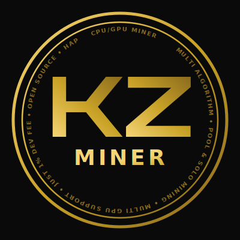

# KZMiner

<p align="center">
  
</p>

Multi-algorithm CPU/GPU miner, with CUDA support for Nvidia GPUs
(Turing, Ampere, Ada Lovelace, and Blackwell architectures).

KZMiner currently supports **Argon2id (Bitcoin09 / 09C)**, with more
algorithms planned. The architecture separates mining logic (CPU/GPU
workers, dashboard, dev fee, pool/solo networking) from the algorithm
implementation itself, so new algorithms can be added without touching
the rest of the codebase.

## Features

- Multi-algorithm design (Argon2id / BTC09 supported today, more planned)
- CPU and GPU mining, individually or combined in the same process
- Solo mining via the official BTC09 Open Mining Protocol v1 (HTTP)
- Pool mining via a third-party protocol (tested against `hk.ntmminer.com`)
- Multi-GPU support with automatic CUDA device ordering (`CUDA_DEVICE_ORDER=PCI_BUS_ID`)
- Configurable GPU intensity (VRAM usage) from 1 (light) to 5 (maximum)
- Automatic reconnection on pool connection loss
- 1% developer fee (see below)
- Live dashboard: hashrate, shares, difficulty, CPU/GPU temperature and usage, load average

## Developer fee

KZMiner includes a 1% developer fee, in line with common practice for
open-source miners (NTMminer, T-Rex, lolMiner, and similar tools). Every
100 seconds, mining switches to computing for the developer's wallet
for 1 second, then resumes computing for your wallet. Anything found
during that 1-second window (shares, blocks) is submitted under the
developer's wallet and is not refunded or shared back - this is a real
fee, not a simulated one. This is fully transparent: you can see the
switch happen live in the console output
(`[devfee] now mining for the developer wallet` /
`resumed mining for your wallet`), and the dev fee wallet address is a
public constant in `src/devfee/devfee_config.h`.

> Important: this fee is in addition to whatever fee the pool you
> connect to charges. KZMiner's 1% is charged by the miner itself,
> regardless of which pool you point it at. Pools often charge their
> own separate fee on top of that (commonly 1-5%, sometimes more) -
> check your chosen pool's dashboard or documentation for its exact
> fee before assuming your total cost is just 1%. For example, some
> third-party BTC09 pools charge a 3% pool fee, which combined with
> KZMiner's 1% brings the real total to 4%. This is not unique to
> KZMiner - it applies to any miner used against any pool - but it is
> easy to overlook, so please check both fees, not just this one.

## License

KZMiner is licensed under the **GNU General Public License v2 or later
(GPLv2+)**. See [LICENSE](LICENSE) for the full text.

This project vendors a modified CUDA Argon2 backend derived from
[argon2-gpu](https://github.com/WebDollar/argon2-gpu) (originally by
Ondrej Mosnacek, GPLv2+). See
[third_party/argon2-gpu/NOTICE.md](third_party/argon2-gpu/NOTICE.md)
for full attribution and a list of modifications.

## Requirements

- Linux (tested on Ubuntu 24.04)
- CMake >= 3.18
- A C++17 compiler (GCC recommended)
- CUDA Toolkit 12.x (for GPU mining; CPU-only builds do not require CUDA)
- libargon2 (compiled with AVX2 support recommended for best CPU performance)
- libcurl
- nlohmann-json

## Download

Precompiled Linux x86_64 binaries, checksums, and release notes for
every version are available on the
**[Releases page](https://github.com/Koriaz98/KZMiner/releases)**.

> **Note:** precompiled binaries are built on Ubuntu 24.04 (x86_64,
> AVX2). If a binary fails to start on your system (e.g. `Illegal
> instruction` or a missing library error), building from source
> (below) is the recommended, most portable option.

## Building

```bash
git clone --recursive https://github.com/Koriaz98/KZMiner.git
cd KZMiner
mkdir build && cd build
cmake .. -DCMAKE_BUILD_TYPE=Release
make -j$(nproc)
```

The resulting binary is `build/kzminer`.

## Usage

```bash
./kzminer -o <pool> -u <wallet[.rigname]> [options]
```

### Required

| Flag | Description |
|---|---|
| `-o <pool>` | Solo: coordinator URL (e.g. `https://btc09.org`). Pool: `host:port` (e.g. `hk.ntmminer.com:8344`) |
| `-u <wallet>` | Your BTC09 (09C) address. Optionally append `.rigname` to identify this rig on the pool (e.g. `4ySp...VN6V.rig01`) |

### Optional

| Flag | Description |
|---|---|
| `--mode <solo\\|pool>` | `solo` (default): Open Mining Protocol v1, 100% of the block reward if found. `pool`: third-party pool protocol, smoothed payout |
| `--cpu` | Enable CPU mining |
| `--gpu` | Enable GPU mining (CUDA, Nvidia only) |
| `--cpu-threads <n>` | Number of CPU threads (default: all logical cores) |
| `--intensity <1-5>` | Fraction of free VRAM used per GPU: 1=15%, 2=30%, 3=50% (default), 4=70%, 5=90% |
| `--worker <name>` | Rig/worker name (overrides the `.rigname` suffix on `-u`) |

`--cpu` and `--gpu` can be combined to mine on both simultaneously. If
neither is specified, CPU mining is used by default.

### Examples

```bash
# Solo mining, GPU only, intensity 3
./kzminer -o https://btc09.org -u 4ySp...VN6V --gpu

# Pool mining, CPU + GPU combined, custom rig name
./kzminer --mode pool -o hk.ntmminer.com:8344 -u 4ySp...VN6V.rig01 --cpu --gpu --intensity 4
```

## Supported GPU architectures

The CUDA backend targets the following architectures, independent of
which mining algorithm is in use:

| GeForce series | Architecture | Compute capability |
|---|---|---|
| RTX 20xx / GTX 16xx | Turing | sm_75 |
| RTX 30xx | Ampere | sm_86 |
| RTX 40xx | Ada Lovelace | sm_89 |
| RTX 50xx | Blackwell | sm_120 |

## Disclaimer

This software is provided "as is", without warranty of any kind. Use at
your own risk. KZMiner is not affiliated with the official BTC09 project
or with any mining pool.
